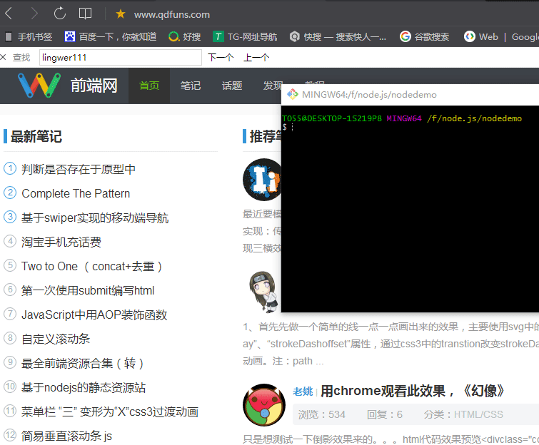
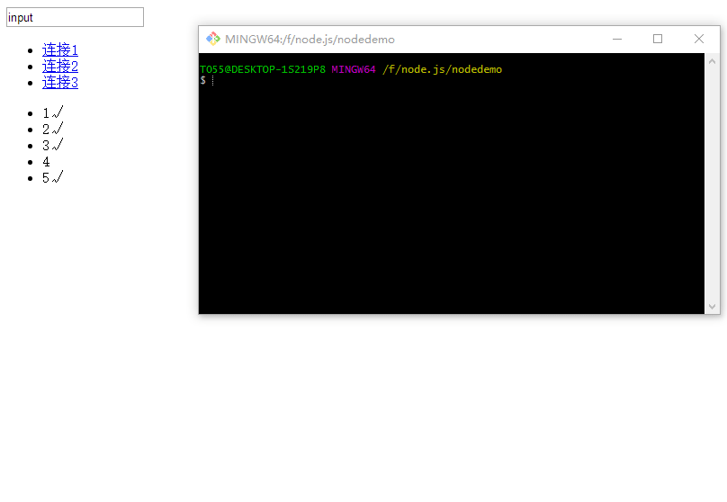

# browser-x文章
**browser-x** 是一个基于 NodeJS 实现的轻量级“浏览器”，它的目标是高效的实现 DOM 中最核心的特性。简单来说就是能获得DOM的一些属性，比如类名啊，CSS的样式啊，HTML内容啊什么的，不过他并不是以我们平常的盒子模型那样输出这些内容能通过图像来查看这些属性，而是以一行一行代码来呈现。听起来有点不好理解，没事我们看下面的demo：


接下来我们来看看如何做到的：
1. **首先我们要npm intsall browser-x -s 下载依赖包（安装node.js是必须的）。**
2. **在node_modules同目录下 新建一个index.js的文件。**
3. **index.js的代码：**
``` js
//首先引入基本包
var browser = require('browser-x');
//要抓取页面的地址（不支持https开头的）
var url = "http://www.qdfuns.com/";
browser({
    url: url,
    //支持加载外部的CSS
    loadCssFile: true,
    //关闭内部解析错误
    silent: false
}, function (errors, window) {
    if (errors) {
        throw errors;
    }
    var document = window.document;
    //获取我们要抓取的目标的id和下面的标签
    var classNa = document.getElementById("column-side").getElementsByTagName("li");
    //创立一个数组，用来存储结果。
    var classNaArr = [];
    //做一个循环
    for (var j = 0; j < classNa.length; j++){
        //符合结果的进入数组
        classNaArr.push(classNa[j].childNodes[0].innerHTML);
        
    };
    //输出结果
    console.log(classNaArr);
});
```
都准备好了，然后我们在cmd里面找到这个文件 输入node index就可以看到结果了。它可以抓取CSS的样式，content的内容啊，即使是:after这样的选择器也可以获取到，但是在DOM API中有关URL的参数可能会报错因为"\\"符号的问题。
上面那个例子，可以能看起来有点疑惑没事，下面有一个例子或许比较简单。
首先我们自己创建一个HTML文件
``` vbscript-html
<!DOCTYPE html>
<html lang="en">
    <head>
        <meta charset="utf-8">
        <title>demo</title>
    </head>
    <body>
        <input type="text" id="su" value="input" />
        <ul id="demo-a">
            <li>
                <a href="./demo1.html">连接1</a>
            </li>
            <li>
                <a href="./demo2.html">连接2</a>
            </li>
            <li>
                <a href="./demo3.html">连接3</a>
            </li>
        </ul>
        <ul id="demo-class">
            <li class="class1">1</li>
            <li class="class1">2</li>
            <li class="class1">3</li>
            <li class="class2">4</li>
            <li class="class2 class1">5</li>
        </ul>
    </body>
</html>
```
新建的js文件
``` js
var browser = require('browser-x');
var url = "./demo.html";
browser({
    url: url,
    loadCssFile: true,
    silent: false
}, function (errors, window) {
    if (errors) {
        throw errors;
    }
    var document = window.document;
    // 获取页面的title
    console.log(document.title);
    //获取id为su的input标签名字
    console.log(document.getElementById("su").value);
    //获取页面中a标签的数量
    console.log(document.getElementsByTagName("a").length);
    //获取第一个a标签中的href
    console.log(document.getElementsByTagName("a")[0].getAttribute("href"));
    //获取所有a标签的href和innerHTML的内容
    var a = document.getElementById("demo-a").getElementsByTagName("a");
    var aHrefArr = [];
    var aTextArr = [];
    for (var i = 0 ; i < a.length; i++){
        aHrefArr.push(a[i].getAttribute("href"));
        aTextArr.push(a[i].innerHTML);
    };
    console.log(aHrefArr,aTextArr);
    //获取相同类名下的innerHTML内容
    var classNa = document.getElementById("demo-class").getElementsByTagName("li");
    var classNaArr = [];
    // console.log(classNa[0].className) 首先获取标签的数量
    for (var j = 0; j < classNa.length; j++){
       /* 一个标签可能有多个类名，用空格把他切割*/
        var classNas = classNa[j].className.toString().split(" ");
        // 根据一个标签的类名数量再做一个循环
            for(var x = 0; x < classNas.length; x++){
                // console.log(classNas[x]);
                // 判断标签内类名是否有满足需要的类名。
                if(classNas[x] == 'class1') {
                // console.log(classNa[j].innerHTML,classNas)
                // 如果有则把便签的内容输入数组
                    classNaArr.push(classNa[j].innerHTML);
                }
            }
    };
    console.log(classNaArr);
});
```
结果：

这样不知道能不能理解的更透彻呢。
总的来说browser-x可以作为一个简单的爬虫，对于熟悉DOM操作的人，上手简单，不过他不支持vue这样的dom结构。也可以作为样式的追踪它可以捕抓一些CSS的样式，包括继承父及的属性。
